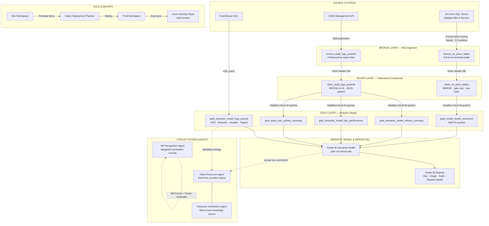

# Data Engineering & Systems Architecture Portfolio

> **Author:** Christopher Jiminez
> **Role:** Data Engineer | IT Business Systems Analyst | AI Automation Engineer
>
> **Platform:** Microsoft Fabric · Azure · Copilot Studio · Azure DevOps
> **Stack:** PySpark · KQL · Power Query M · Delta Lake · T-SQL · O365 Management API · Python

---

## Impact at a Glance

- **Eliminated the 5,000-row audit log cap** — switched from PowerShell to O365 Management API blob pagination, capturing 100% of daily Power BI activity regardless of volume
- **Detected silent pipeline failures** — built cross-reference validation that flags SUCCESS-reported runs where actual loaded rows fall below 95% of source — a failure mode invisible to standard monitoring
- **Reduced provider resource lookup from 15 minutes to under 30 seconds** — Copilot Studio agent replacing manual Excel/PDF searches during client appointments
- **Removed familiarity bias from employee recognition** — AI scoring engine evaluating written nomination evidence across 6 weighted dimensions before council review
- **Full CI/CD from Dev to Prod** — Fabric Deployment Pipeline + Azure DevOps Git integration version-controlling all notebooks, pipelines, M queries, and DAX measures

---

## Architecture Overview



---

## Project 1 — Microsoft Fabric Data Platform

A full **Medallion Architecture (Bronze → Silver → Gold)** observability and analytics platform built on Microsoft Fabric. Ingests data from on-premises SQL Server, the O365 Management API, and the Fabric Eventhouse — transforming raw logs and operational data into business-ready Gold layer tables with complete metadata lineage, column profiling, and ingestion validation.

### Refresh Schedule

| Schedule | Time (UTC) | What Runs |
|----------|-----------|-----------|
| Audit Log Pipeline | 2:00 AM | O365 Graph API — full prior-day audit capture |
| Bronze + Silver Master | 6:00 AM | On-prem ingestion → Silver cleanse & conform |
| Gold + Semantic Model | 7:00 AM | Gold DDL → Dataflow Gen2 → Gold DML → Model refresh |

### Key Engineering Decisions

**Bypassing the 5,000-Row Audit Log Limit**
The PowerShell `Search-UnifiedAuditLog` cmdlet has a hard 5,000-row cap with no error when the limit is hit — data is silently lost. Switched to the O365 Management Activity API which paginates content blob URIs via `NextPageUri` headers. Each blob holds up to 1,000 records and all blobs are iterated for the full 24-hour window, capturing every record regardless of daily volume.

**Silent Failure Detection**
A pipeline reporting SUCCESS does not guarantee all data loaded. The validation notebook cross-references operation status logs against actual source vs destination row counts per batch date. If the log reports ≥95% success rate but the loaded row percentage is <95%, the run is flagged as a silent failure — a scenario that would otherwise only surface when a report consumer notices missing data days later.

**Staging → MERGE Pattern for Gold (DECIMAL Precision Preservation)**
Dataflow Gen2's Replace write method drops and recreates the target table on every run, silently downcasting `DECIMAL(18,6)` columns to `DOUBLE` — introducing floating point rounding errors in financial and measurement fields. Solution: a DDL notebook runs first to lock precision column types, Dataflow Gen2 writes to `_staging` tables, and a DML notebook MERGEs staging → Gold. The Gold schema is never touched by Dataflow.

**Control Table Server Switching**
Every source table has one row in `control_table` defining its watermark, load type, server connection, source schema, and destination table. The Fabric Pipeline uses a ForEach loop, If Condition (Full vs Incremental), and Switch activity (server routing) driven entirely by this table. Adding a new source table is a single row insert — no pipeline changes required.

**1-Hour Buffer Between Silver and Gold**
Dataflow Gen2 reads Silver Delta tables at query time using a point-in-time snapshot. Running Gold immediately after Silver risks reading a partially-flushed transaction log. The 1-hour gap ensures Delta checkpoints are complete before Dataflow queries them.

**Dev → Prod Deployment Pipeline + Azure DevOps**
All development happens in a Dev Fabric workspace. Changes are promoted to Prod via Fabric Deployment Pipeline with a diff review gate. The Prod workspace auto-syncs to an Azure DevOps repo on every promotion — version-controlling notebooks, Data Pipeline JSON, Dataflow Gen2 M queries (`.pq`), and the semantic model including all DAX measures (`.bim`).

---

## Project 2 — Copilot Studio AI Agents

Two production Microsoft Copilot Studio agents deployed to Microsoft Teams, SharePoint, and the organizational Microsoft App Store. Configured with Pay-As-You-Go metered billing on Azure — enabling all staff access without requiring Copilot Studio Premium per-user licenses.

### Agent 1: Client Resource Agent

**Problem:** Healthcare and social service providers spent 5–15 minutes per appointment manually searching Excel files and printed flyers to find community resources for clients.

**Solution:** A dual-agent system. The primary agent answers real-time resource lookup questions during appointments — finding housing, food assistance, DV resources, homelessness services, mental health support, and more — using a SharePoint-hosted knowledge base. A second web-facing agent scrubs the knowledge source on schedule, detecting outdated phone numbers, addresses, and hours by cross-referencing live web sources, and producing a discrepancy report showing what is wrong, what it should be, and where the verification came from.

**Rule Engine:** Three-layer categorization combining explicit PrimaryCategory tags on each facility, a regex keyword-to-SubCategory tag matrix for modifier filters (walk-in, children, Spanish, 24-hour), and topic-level intent routing for ambiguous queries. Conflict resolution rules handle multi-category queries — domestic violence always takes priority over housing for client safety.

**Licensing:** Configured Pay-As-You-Go metered billing (~$0.01/message) on an Azure subscription instead of $22/user/month Premium licenses — enabling all staff on Microsoft 365 Basic to access the agent without license upgrades.

**Deployment:** Microsoft Teams channel · SharePoint web part embed · Organizational MS App Store

### Agent 2: HR Recognition Agent

**Problem:** Employee recognition nominations were scored subjectively by council members who naturally advocated for familiar colleagues regardless of demonstrated performance, creating systematic familiarity bias.

**Solution:** A Copilot Studio agent that ingests Microsoft Forms nomination submissions via Power Automate, scores each nomination across 6 weighted competency dimensions, and produces a structured score card before council members review. The agent scores the written evidence only — it never receives the nominee's department, tenure, seniority, or nominator identity. Council members score independently alongside the agent score, preserving human judgment while anchoring discussion in objective evidence.

**Scoring Dimensions:**

| Dimension | Weight | What the Agent Evaluates |
|-----------|--------|--------------------------|
| Impact | 25% | Specific situation, measurable outcome, before/after described |
| Consistency | 20% | Duration, frequency, multiple examples across time |
| Collaboration & Teamwork | 20% | Named colleagues, nature of support, impact on others |
| Initiative & Innovation | 15% | Self-initiated action, problem identified before being asked |
| Values Alignment | 10% | Named org value tied to specific observed behavior |
| Client / Community Impact | 10% | Named client situation, clear employee-to-outcome line |

**Deployment:** Microsoft Teams · SharePoint · MS App Store · Power Automate (Forms trigger)

---

## Repository Structure

```
Data-Engineering-Systems-Architecture-Portfolio/
│
├── kql/                          # Eventhouse KQL queries (20 total)
├── semantic_model/               # Gold layer SemanticModelLogs + live system tables
├── audit_logs/                   # O365 API audit log Bronze & Silver
├── metadata/                     # Metadata master, lineage map, column profiling
├── validation/                   # Pre/post ingestion row count validation
├── pipeline_docs/                # Pipeline orchestration, DDL, DML, CI/CD reference
├── reporting_layer/              # Power BI report design documentation
├── sql_server_ops/               # SQL Server long-running job monitor
└── copilot_agents/
    ├── client_resource_agent/    # Dual-agent resource lookup system
    └── hr_recognition_agent/     # Weighted nomination scoring agent
```

---

## Complete File Index

### `/kql/` — Eventhouse KQL Queries
| File | Description |
|------|-------------|
| `workspace_logs_query.kql` | 8 queries: workspace activity, failures, user summaries, slow ops, refresh trends |
| `semantic_model_logs_query.kql` | 12 queries: DAX performance, CPU/IO profiling, identity parsing, ApplicationContext parsing, duplicate detection, watermark check, real-time feed |

### `/semantic_model/` — Gold Layer SemanticModelLogs
> SemanticModelLogs has no Bronze or Silver layer. The semantic model sits on top of Gold tables — these logs track report and visual usage activity against those Gold tables and are themselves Gold-layer output.

| File | Description |
|------|-------------|
| `01_gold_semantic_model_logs_parsed.py` | KQL ingestion → two Gold tables. Parses `ApplicationContext.Sources[0]` JSON to extract UPN, ReportId, VisualId, PageId, VisualName, PageName. Extracts DAX query text from EventText. DDL + MERGE upsert. |
| `02_semantic_model_system_tables_live.py` | Live PBIX connection via `sempy.fabric.evaluate_dax()` — queries `$SYSTEM.TMSCHEMA_TABLES`, `TMSCHEMA_COLUMNS`, `TMSCHEMA_MEASURES`, `TMSCHEMA_PARTITIONS`, `DISCOVER_STORAGE_TABLE_COLUMNS` directly from the XMLA endpoint. No CSV exports. Builds `metadata_master` Delta table. |
| `03_gold_semantic_model_usage_analytics.py` | 4 Gold analytics tables: report/visual render usage with performance tiers, DAX query performance with CPU-bound profiling, user engagement tiers (Power/Active/Regular/Casual), daily model usage summary. |

### `/audit_logs/` — O365 Audit Log Pipeline
| File | Layer | Description |
|------|-------|-------------|
| `07_bronze_audit_logs_graph_api.py` | Bronze | O365 Management API full blob pagination — bypasses 5,000-row PowerShell limit. Runs 2am daily for prior-day data. Service principal auth via Azure Key Vault. |
| `08_silver_audit_logs_ddl_dml.py` | Silver | DDL + incremental MERGE upsert. IsSuccess cast to boolean, AppId/CapacityId/ArtifactKind extracted from raw_json. Watermark-driven incremental load. |

### `/metadata/` — Metadata Master & Column Profiling
| File | Description |
|------|-------------|
| `04_semantic_model_system_tables.py` | Reference: original system tables loader |
| `05_metadata_health_checks.py` | Null rates, column usage, measure catalog, layer row count summary |
| `06_column_profiling.py` | Reference: original column profiling |
| `13_lakehouse_system_tables_catalog.py` | Iterates all 3 Lakehouses via `spark.catalog.listTables()` + Delta history. Builds `lakehouse_column_catalog` — physical column inventory with row counts, last modified, partition info. |
| `14_metadata_master_full_lineage.py` | Two-source join: semantic model objects (live sempy) + lakehouse physical columns. Detects type mismatches, orphaned columns, hidden objects. Writes `metadata_master_full` + `metadata_lineage_map`. |
| `15_column_profiling_metadata_driven.py` | Metadata-catalog-driven profiling. Only profiles columns with confirmed lakehouse mappings. Carries full semantic lineage on every result row — identifies which reports are impacted by a data quality issue. CRITICAL/WARN/OK health flags. |

### `/validation/` — Ingestion Integrity
| File | Description |
|------|-------------|
| `09_rowcount_validation_pre_post.py` | Source vs destination row count comparison per batch date. CRITICAL_MISSING / WARN_SHORT_LOAD / WARN_OVER_LOADED / PASS classification. Silent failure detection: cross-references SUCCESS status logs against actual loaded row percentages. |

### `/pipeline_docs/` — Orchestration, DDL, DML, CI/CD
| File | Description |
|------|-------------|
| `10_control_table_ddl_silver_master.py` | `control_table` DDL with watermark, load type, server switch fields + seed data. Silver Master Notebook orchestrating all DML notebooks via `mssparkutils.notebook.run()` with watermark advancement and `audit_sp()` logging. |
| `11_gold_dataflow_gen2_m_queries.pq` | 3 Power Query M transformations for Dataflow Gen2: refresh health summary, audit user activity, model health scorecard with A/B/C/D composite scoring. |
| `12_long_running_jobs_monitor.sql` | 3-section T-SQL: currently running jobs with overrun % vs historical average, recently completed anomalies, full job health scorecard with coefficient of variation. |
| `16_pipeline_audit_log_ddl_audit_sp.py` | `pipeline_audit_log` DDL + `audit_sp()` Python function callable from any notebook. Logs rows read/written/updated, watermark, duration, error details, run status. |
| `17_bronze_master_pipeline_reference.py` | Full Fabric Pipeline expression reference: ForEach, If Condition, Switch, Copy Data source queries, watermark update scripts. PySpark equivalent of all copy/routing logic. |
| `18_gold_ddl_precision_tables.py` | Gold + staging table DDL with explicit DECIMAL precision. Idempotent — runs before every Dataflow Gen2 cycle to lock schema. |
| `19_gold_dml_merge_staging_to_gold.py` | MERGE from Dataflow Gen2 staging → Gold. Hash-based change detection, `_dw_created_at` preservation, post-merge row count validation. |
| `20_master_pipeline_architecture.py` | Full pipeline hierarchy diagram, both schedules, 5 key design decisions, complete Fabric Pipeline expression cheat-sheet. |
| `21_deployment_pipeline_devops_integration.md` | Dev → Prod Fabric Deployment Pipeline architecture. Azure DevOps Git integration — repo structure, promotion process, rollback procedure, branch strategy, setup reference. |

### `/reporting_layer/` — Power BI Reports
| File | Description |
|------|-------------|
| `README.md` | 4 report designs built on Gold layer: Workspace Operations Dashboard, Semantic Model Usage Intelligence, Audit Log Activity Monitor, Pipeline Operations Health. Includes DAX measures, semantic model table connections, RLS configuration, and deployment notes. |

### `/sql_server_ops/` — SQL Server Operations
| File | Description |
|------|-------------|
| `README.md` | SQL Server Agent job health monitoring — overrun % vs historical average, anomaly detection, coefficient of variation scoring for erratic jobs. |
| `12_long_running_jobs_monitor.sql` | See `/pipeline_docs/` — cross-referenced here for SQL Server ops context. |

### `/copilot_agents/` — Microsoft Copilot Studio Agents
| File | Description |
|------|-------------|
| `README_copilot_agents.md` | Overview of both agents, shared deployment pattern, licensing strategy, skills demonstrated. |
| `client_resource_agent/01_client_resource_agent_architecture.md` | Full system architecture, knowledge source schema (24 columns), topic flow design, verification report format, Pay-As-You-Go licensing breakdown, deployment steps. |
| `client_resource_agent/02_system_prompts_topic_flows.py` | Complete system prompts for both agents + all topic flow pseudocode (Greeting, Resource Search, Detail View, Eligibility, Fallback, Verification). |
| `client_resource_agent/03_rule_engine_reference.py` | Runnable Python rule engine — 80+ keyword category lookup table, regex subcategory tag matrix, conflict resolution, test cases. |
| `hr_recognition_agent/01_hr_recognition_agent_architecture.md` | MS Forms question design, 6-dimension scoring rubric, positive/negative signal definitions per dimension, system prompt, example score card output, Power Automate flow design, non-bias safeguards. |
| `hr_recognition_agent/02_scoring_engine_reference.py` | Runnable Python scoring engine — Nomination + ScoreCard dataclasses, weighted dimension scoring, rubric level mapping, formatted score card output with council section. |

---

## Technologies Used

| Technology | Usage |
|------------|-------|
| Microsoft Fabric Lakehouse | Delta Lake storage across Bronze, Silver, Gold layers |
| Fabric Eventhouse (KQL) | Real-time workspace and SemanticModelLogs source |
| Fabric Deployment Pipeline | Dev → Prod environment promotion with diff review |
| Azure DevOps | Git version control for all Prod workspace items |
| Kusto Spark Connector | KQL → PySpark DataFrame ingestion |
| PySpark / Delta Lake | All Bronze and Silver transformations |
| Power Query M / Dataflow Gen2 | Gold layer transformations (CI/CD via `.pq` versioning) |
| Office 365 Management API | Full audit log retrieval with blob pagination |
| Microsoft Copilot Studio | AI agent design, topic flows, knowledge sources |
| Power Automate | MS Forms → Copilot agent integration |
| semantic-link (sempy) | Live PBIX XMLA connection for system table extraction |
| Azure Key Vault | Secure credential storage (tenant ID, client ID, secrets) |
| mssparkutils | Notebook chaining, secret retrieval, token acquisition |
| T-SQL / SQL Server msdb | SQL Agent job health monitoring and overrun analysis |
| Power BI | Reports, semantic model, DAX measures, RLS |

---

## How to Run

### Fabric Data Platform
1. Upload notebooks to Fabric workspace via Lakehouse → New Notebook → Import
2. Configure Cell 1 variables in each notebook (Lakehouse names, KQL cluster URI, Key Vault scope)
3. Install `semantic-link` in your Fabric Environment: `%pip install semantic-link`
4. Add Kusto Spark connector via Fabric Environment → Maven: `com.microsoft.azure.kusto:kusto-spark_3.4_2.12:4.4.0`
5. Seed `control_table` using `10_control_table_ddl_silver_master.py` Cell 2
6. Schedule pipelines: Audit Log at 2am · Bronze/Silver at 6am · Gold/SM at 7am

### Copilot Studio Agents
- Rule engine (`03_rule_engine_reference.py`) and scoring engine (`02_scoring_engine_reference.py`) run locally with Python stdlib only — no Fabric required
- Full agent configuration lives in Microsoft Copilot Studio (tenant-specific, not exportable to Git)
- Architecture and topic flow design documented in each agent's `01_*_architecture.md` file

### Local Development (Rule Engine + Scoring Engine only)
```bash
python -m venv venv
venv\Scripts\activate        # Windows
source venv/bin/activate     # Mac/Linux
pip install -r requirements.txt
python copilot_agents/client_resource_agent/03_rule_engine_reference.py
python copilot_agents/hr_recognition_agent/02_scoring_engine_reference.py
```
