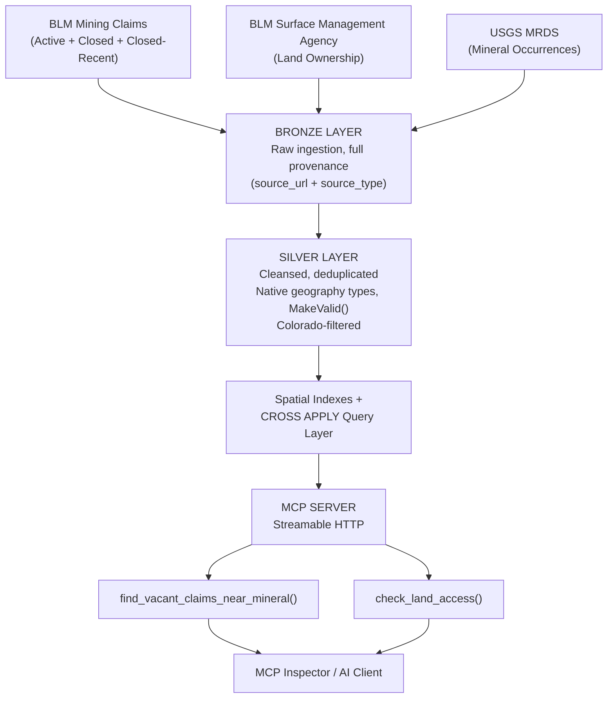

# RockHound — Colorado Rockhounding Intelligence Platform

A governed, spatially-aware data platform that answers a real question: "Where can I legally go rockhounding in Colorado, and what am I likely to find?" Built end-to-end from raw federal and state government data through a Medallion Architecture (Bronze/Silver-style layering) into a governed **MCP (Model Context Protocol) server** — allowing an AI agent to answer rockhounding questions grounded in real, curated, trustworthy spatial data rather than raw or unverified sources.

**Repo structure:** SQL scripts in [`/sql`](./sql), Python code in [`/python`](./python) — see those folders for the actual implementation.

---

## The Goal

Combine multiple independent public datasets — mining claim status, land ownership, and historical mineral occurrence records — into a single queryable platform, then expose that data to an AI system through a governed interface that only surfaces specific, safe, pre-approved queries rather than raw database access. This mirrors the same "AI-ready, governed data product" pattern increasingly asked for in modern data engineering roles.

**Specific question this answers:** "Find vacant/lapsed mining claims near documented occurrences of a mineral, and tell me whether I'm actually allowed to be there."

---

## Architecture



---

## Real Data Sources (all public, all free)

| Source | What it provides | Records (Colorado, filtered) |
|---|---|---|
| BLM MLRS Mining Claims — Not Closed | Active mining claims | 14,699 |
| BLM MLRS Mining Claims — Closed (full history) | Historical/vacant claims | 288,158 |
| BLM MLRS Mining Claims — Closed (last year) | Recency flag source | 1,165 |
| BLM Colorado Surface Management Agency | Land ownership (BLM, USFS, private, tribal, etc.) | 21,175 |
| USGS Mineral Resources Data System (MRDS) | Historical documented mineral occurrences | 17,669 |
| US Census TIGER/Line — Counties | County boundaries (national file, Colorado-filtered) | 64 |
| US Census TIGER/Line — Places | City/town/CDP boundaries, Colorado-specific | varies |

All source records carry `source_url` and `source_type` (e.g., "Government Agency") for full data lineage and provenance tracking — a governance pattern built in intentionally, not an afterthought.

---

## Tech Stack

- **SQL Server** — native `geography` spatial data type, spatial indexing, `STDistance`/`STIntersects`/`STContains`, `MakeValid()`
- **Python** — `geopandas`, `pandas`, `pyodbc`, `shapely`
- **MCP Python SDK** (`mcp.server`) — Streamable HTTP transport
- **MCP Inspector** — official tooling for testing/verifying MCP servers
- **Cloudflare Tunnel** — local HTTPS exposure for remote MCP client testing

---

## Tools & Platforms Used

A detailed breakdown of what was used for what, since the actual development environment is part of the real story here.

### Data Sources (where the raw data came from)
| Source | Access Method | Use Case |
|---|---|---|
| [BLM Colorado GIS Data Portal](https://www.blm.gov/site-page/services-geospatial-gis-data-colorado) | Direct download (Shapefile/GeoJSON) | Colorado-specific Surface Management Agency (land ownership) data |
| BLM National GIS Hub (ArcGIS Hub) | Direct download (GeoJSON / File Geodatabase) | Mining claims (Active, Closed, Closed-Last-Year) — note: these particular downloads turned out to be *national* scope despite being found via a Colorado-focused search, which is why the Colorado bounding-box filter exists in `load_bronze.py` |
| [USGS MRDS](https://mrdata.usgs.gov/mrds/) | Direct download (CSV, "Flattened" format) | Historical mineral occurrence records — also nationwide by default, filtered to Colorado via the `state` column |

### Database & Query Development
| Tool | Use Case |
|---|---|
| **SQL Server Express** (local instance, named `SQLEXPRESS`) | The actual database engine — chosen because it's free and already commonly available for a personal project |
| **SQL Server Management Studio (SSMS)** | Schema creation, data verification, query development and testing, and — critically — **execution plan analysis** (Ctrl+M) used to diagnose the spatial index performance issue |

### Python Development
| Tool | Use Case |
|---|---|
| **Python 3.14** | Data ingestion scripting (`load_bronze.py`) and the MCP server itself (`rockhound_server.py`) |
| **pip** | Package management — `geopandas`, `pandas`, `pyodbc`, `shapely`, `mcp` |
| **PowerShell** | Running all Python scripts, file/folder management, and — notably — used directly to *write* source files via here-strings (`@'...'@ | Set-Content`) when a text-editor save issue caused repeated stale-file problems mid-build |
| **winget** (Windows Package Manager) | Installing Python, the ODBC Driver 18 for SQL Server, and `cloudflared` |

### MCP-Specific Tooling
| Tool | Use Case |
|---|---|
| **MCP Python SDK** (`mcp` package, `mcp.server`) | Building the actual governed MCP server and its two tools |
| **MCP Inspector** (`npx @modelcontextprotocol/inspector`) | The official tool used to test and verify the server's tools work correctly — this became the primary demo/verification method after a specific consumer AI client's remote-connector flow turned out to require OAuth client registration that was out of scope for this project |
| **Cloudflare Tunnel** (`cloudflared`) | Exposed the local Streamable HTTP server over a temporary public HTTPS URL, since some MCP client integrations require HTTPS even for local development/testing |

### Version Control & Hosting
| Tool | Use Case |
|---|---|
| **GitHub** | Hosting this repository as part of a broader data engineering portfolio |


Two governed tools, deliberately scoped rather than exposing raw SQL access to an AI system:

**`find_vacant_claims_near_mineral(mineral_name, max_distance_miles)`**
Finds vacant/lapsed claims near documented historical occurrences of a given mineral, flagging which claims closed most recently (freshest opportunities), which county each falls in, and sorting by proximity.

**`check_land_access(latitude, longitude, mineral_search_radius_miles)`**
Given a coordinate, returns a full site report: land ownership type, whether any mining claim covers that point (and if so, active vs. vacant), the county, the nearest city and its distance, and any minerals documented within a configurable search radius.

Both tools query only the curated Silver layer through fixed, parameterized queries — the AI never gets arbitrary database access, only these specific, safe, purpose-built answers.

---

## Real Engineering Challenges Solved

This section exists because the debugging process is arguably the most representative part of the whole project — real data engineering isn't a clean first pass. See [`/sql/04_example_queries.sql`](./sql/04_example_queries.sql) for the actual diagnostic queries used to find and fix these.

1. **Invalid spatial geometry.** Real-world government GIS polygon data included self-intersecting/invalid geometries that caused runtime failures in SQL Server's strict `geography` type (`24144: instance is not valid`). Fixed with `.MakeValid()` applied during the Bronze-to-Silver transformation — see [`/sql/02_silver_schema_and_transform.sql`](./sql/02_silver_schema_and_transform.sql).

2. **A silent data-mapping bug.** The mineral search was initially matching against `mineral_name` (a mine's site name, e.g. "Silver King Mine") rather than `commodity_type` (what was actually documented as found there) — a correctness bug caught by comparing row counts: 11 site-name matches for "Quartz" vs. 82 real commodity matches.

3. **A real performance/query-plan problem.** A straightforward `JOIN ... ON STDistance(...) < X` pattern caused queries to silently take 13+ minutes for common minerals, because SQL Server's optimizer wasn't using the spatial index for that join shape — confirmed via execution plan analysis showing 124M+ estimated row operations on a nested loop join. Fixed by restructuring the query around `CROSS APPLY` (the documented pattern for reliably triggering spatial index usage in nearest-neighbor searches), bringing the same query down to ~36 seconds. See [`/sql/04_example_queries.sql`](./sql/04_example_queries.sql).

4. **National-scope data filtering.** Several "Colorado" datasets from federal sources were actually nationwide (one active-claims file was 579,730 rows before filtering to Colorado's 14,699). Filtered via bounding-box intersection during ingestion rather than loading and discarding downstream — see `COLORADO_BBOX_WKT` in [`/python/load_bronze.py`](./python/load_bronze.py).

5. **MCP client integration.** Discovered that the target MCP client's remote-connector flow expected OAuth client registration even for unauthenticated local servers. Worked around by running the server over Streamable HTTP with a Cloudflare quick tunnel for HTTPS, and validated functionality through the official MCP Inspector tool rather than a single consumer app's specific auth requirements.

6. **Inverted polygon ring orientation, affecting three separate tables.** Shapefile- and File-Geodatabase-sourced polygons (Counties, Cities, and the large historical Claims dataset) were sometimes stored with reversed ring winding order -- SQL Server's `geography` type interpreted these as "everywhere except X" rather than "X," which `.MakeValid()` does not detect or fix (it only repairs self-intersections, not orientation). Diagnosed by checking `STArea()` for implausibly large values (a genuine, correctly-oriented Colorado county should never approach ~510,000,000 sq km -- Earth's total surface area). Fixed with a conditional `.ReorientObject()` based on an area threshold. A first attempt at this fix used the wrong unit (`STArea()` returns square *meters*, not square kilometers), which incorrectly flipped several genuinely large, correctly-oriented counties -- caught and corrected by re-validating against all 64 real Colorado counties.

7. **A recurring parameter-count bug class, and a structural fix.** Repeating `geography::Point(?, ?, 4326)` inline multiple times within a single query made it easy to miscount the required parameter list, causing two separate "wrong parameter count" runtime errors. Fixed structurally by computing the coordinate point once via a SQL `DECLARE @searchPoint GEOGRAPHY = ...` variable and referencing it throughout the query, reducing most queries to just 2 real parameters and eliminating the bug class going forward rather than just fixing the immediate instance.

8. **A data-completeness design gap, not a bug.** `check_land_access` originally returned a single arbitrary claim via `TOP 1` with no explicit ordering. Testing against a real, known claim ("Rocket Six," verified against a friend's actual mining claim data) revealed that 14 separate claims -- 6 active, 8 vacant -- legitimately overlap that one coordinate, which is normal for a dense historic Colorado mining district. The fix wasn't a bug patch but a deliberate design decision: list every active claim by name (since any one of them means "do not dig"), and summarize vacant claims as a count rather than silently picking one and hiding the rest.

---

## Known Issues (honest, in progress)

- **`find_vacant_claims_near_mineral` times out for common minerals (Quartz, Silver) via the MCP tool call**, even though the identical SQL query runs in ~6 seconds directly in SQL Server and returns a large result set (24,570 rows for Quartz before capping). A `TOP (N)` cap was added at the outer query level (tested at 50 and 10 results) but did not resolve the timeout, suggesting the bottleneck may be in result serialization/transmission through the MCP protocol rather than the underlying SQL query itself, or a client-side timeout shorter than the query needs even post-cap. Currently unresolved; next debugging step is comparing execution plans on the capped vs. uncapped query and adding server-side timing around the tool call to isolate where the actual delay occurs.

---

## Example Output

```
> find_vacant_claims_near_mineral(mineral_name="Quartz", max_distance_miles=20)

AVENGER #15, Park County - 0.7 mi from documented Quartz
GAMBLE NO 1, Park County - 2.9 mi from documented Quartz
SARAH K #45, Chaffee County - 4.6 mi from documented Quartz
...

> check_land_access(latitude=39.5, longitude=-105.7)

Land type: USFS, covered by claim '#1' (VACANT)
County: Park County
Nearest city: Fairplay (3.2 mi away)
Documented minerals within 2.0 mi: Gold, Quartz, Silver
```

---

## Repo Contents

```
RockHound/
├── README.md
├── sql/
│   ├── 01_bronze_schema.sql          -- Bronze table DDL
│   ├── 02_silver_schema_and_transform.sql  -- Silver DDL + MakeValid() + dedup logic
│   ├── 03_spatial_indexes.sql        -- Spatial index creation
│   ├── 04_example_queries.sql        -- Diagnostic + optimized query patterns
│   └── 05_cities_counties_schema_and_load.sql  -- County/city boundary layer
└── python/
    ├── load_bronze.py                -- Bronze ingestion (Colorado-filtered, fast bulk insert)
    └── rockhound_server.py           -- MCP server with governed tools
```

---

## Roadmap (Phase 2 / Phase 3, scoped but not yet built)

- **Phase 2:** Rivers/streams (placer deposit potential), hot springs (mineral-forming geology), bedrock/geologic formation data (Macrostrat) — same Bronze-to-Silver spatial pattern, new sources.
- **Phase 3:** Trailhead/parking entry points, elevation data, and vehicle-specific road access matching (ground clearance / 4WD requirements vs. a specific vehicle profile).

---

## Data Attribution

Data provided by the Bureau of Land Management (BLM) and U.S. Geological Survey (USGS), used in accordance with their public data terms. This is a personal project and is not affiliated with or endorsed by BLM or USGS. Data is provided "as is" and may contain errors or omissions — always verify claim status and land access independently before visiting any site in person.
